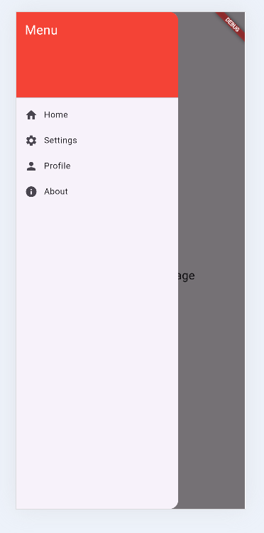

# Drawer Navigation Demo

A simple Flutter app demonstrating the **Drawer** widget for navigation between multiple pages.

---

## Widget Used

**Drawer**

The `Drawer` widget provides a sliding navigation panel that lets users move between different sections of an application.

---

## How to Run

1. Clone this repository.
2. Open the project in Android Studio or VS Code.
3. Run:
   ```bash
   flutter pub get
   ```
4. Start the app:
   ```bash
   flutter run
   ```

---

## Three Drawer Widget Attributes

| Attribute | What it changes on screen |
|-----------|---------------------------|
| **child** | Specifies the widget displayed inside the drawer. In this project, it contains a `ListView` with the navigation menu. |
| **backgroundColor** | Changes the background color of the drawer. (Not used in this project, so the default white background is shown.) |
| **elevation** | Controls the shadow depth of the drawer, making it appear more or less raised above the page. |

---

## Screenshot

Replace the image below with your screenshot after running the application.

```markdown

```


---

## Features

- Navigation Drawer
- Home Page
- Settings Page
- Profile Page
- About Page
- Page navigation using `Navigator.pushReplacement()`

---

## Meaningful Commit Messages

```text
Initial Flutter project setup

Add reusable navigation drawer

Implement Home, Settings, Profile, and About pages

Connect drawer navigation using Navigator.pushReplacement

```